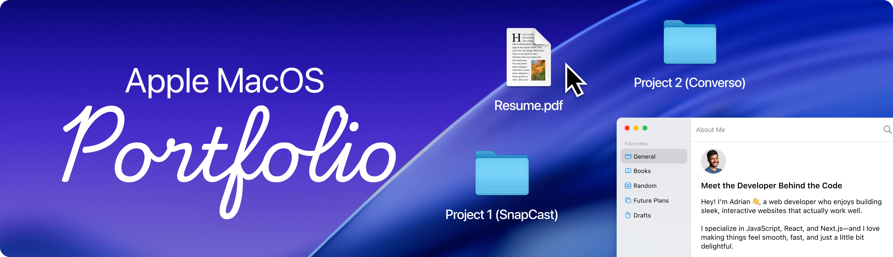

# Vitthal's Portfolio

<div align="center">

[](https://vitthalganeshshivane.github.io/portfolio)

<br />


A fully interactive macOS-inspired desktop portfolio with window management, draggable Finder, Safari browser, Photos gallery, Terminal, and GSAP-powered animations.

</div>

---

## Table of Contents

1. [Project Overview](#project-overview)
2. [Tech Stack](#tech-stack)
3. [Features](#features)
4. [Architecture & Data Flow](#architecture--data-flow)
5. [Project Structure](#project-structure)
6. [State Management](#state-management)
7. [Window System](#window-system)
8. [Finder & File System](#finder--file-system)
9. [Responsive Design](#responsive-design)
10. [Getting Started](#getting-started)
11. [Customization Guide](#customization-guide)
12. [Development Commands](#development-commands)

---

## Project Overview

This portfolio simulates a macOS desktop experience entirely in the browser. It features:

- **Interactive Desktop**: Draggable windows with proper z-index focus management
- **Dock with Physics**: GSAP-powered magnification effect on hover
- **Finder Navigation**: Hierarchical folder/file browsing for projects, resume, and certifications
- **Safari-style Browser**: Blog articles and curated bookmarks
- **Photos Gallery**: Certificate/certification viewer with filtering
- **Terminal**: Tech stack visualization with terminal aesthetic
- **Contact Window**: Social links with vibrant accent colors
- **Resume Viewer**: PDF rendering with responsive scaling

The project is built with a **constant-driven architecture** — all content (dock apps, Finder locations, gallery images, bookmarks, social links) is defined in a single configuration file, making customization straightforward.

---

## Tech Stack

| Technology | Purpose |
|------------|---------|
| **React 19** | UI framework with hooks, lazy loading, and concurrent features |
| **TypeScript** | End-to-end type safety with strict mode |
| **Vite** | Fast dev server and optimized production builds |
| **Tailwind CSS 4** | Utility-first styling with JIT compilation |
| **GSAP** | Professional animations (dock magnification, window transitions, draggable) |
| **Zustand + Immer** | Minimal state management with immutable updates |
| **react-pdf** | PDF resume rendering |
| **react-tooltip** | Dock icon tooltips |
| **Lucide React** | Icon library |
| **dayjs** | Time formatting for navbar clock |
| **Radix UI** | Accessible dropdown primitives (theme selector) |

---

## Features

### Desktop Experience

- [x] **Draggable Windows** — GSAP Draggable integration for window repositioning
- [x] **Window Focus Management** — Monotonic z-index stack ensures last-clicked window is always on top
- [x] **Open/Close Animations** — Scale + fade transitions via GSAP
- [x] **Window Controls** — Close button triggers store action to close window
- [x] **Desktop Icons** — Home component renders project folders as desktop shortcuts
- [x] **Dock Magnification** — Gaussian falloff creates realistic macOS-style magnification
- [x] **Dark/Light Mode** — System preference detection + manual toggle
- [x] **Navbar** — macOS-style top bar with Apple menu, navigation links, and live clock

### Applications

| App | Description |
|-----|-------------|
| **Portfolio (Finder)** | Hierarchical file browser with Work, About, Resume, Photos, and Trash locations |
| **Articles (Safari)** | Blog project cards with external links and bookmark navigation |
| **Gallery (Photos)** | Certification images with category filtering |
| **Contact** | Social links (GitHub, Website, Twitter/X, LinkedIn) with color-coded cards |
| **Skills (Terminal)** | Categorized tech stack displayed in terminal aesthetic |
| **Resume** | PDF viewer with scroll support |

### Mobile Experience

- [x] **iOS-Style Navigation** — Bottom navbar with window stack
- [x] **Mobile Window Wrapper** — Full-screen modal-style windows
- [x] **Touch-Friendly** — Larger tap targets, swipe gestures
- [x] **Responsive Dock** — Single-row icon layout on small screens
- [x] **Mobile Home** — Quick-launch buttons for Resume and Skills

---

## Architecture & Data Flow

```
┌─────────────────────────────────────────────────────────────────┐
│                         App.tsx                                 │
│  • Renders Navbar / MobileNavbar                               │
│  • Renders Home / MobileHome (desktop/mobile surfaces)         │
│  • Renders Dock                                                │
│  • Conditionally renders open windows via useWindowStore       │
└─────────────────────────────────────────────────────────────────┘
                              │
                              ▼
┌─────────────────────────────────────────────────────────────────┐
│                    Window Store (Zustand + Immer)              │
│  • windows: Record<WindowKey, { isOpen, zIndex, data }>       │
│  • openWindow(key, data?) — sets isOpen=true, bumps z-index    │
│  • closeWindow(key) — resets to initial state                  │
│  • focusWindow(key) — brings window to front                  │
└─────────────────────────────────────────────────────────────────┘
                              │
                              ▼
┌─────────────────────────────────────────────────────────────────┐
│                 WindowWrapper (Higher-Order Component)          │
│  • Wraps each window with:                                     │
│    - GSAP open/close animation                                  │
│    - GSAP Draggable for repositioning                          │
│    - Focus-on-click handler                                    │
│    - Mobile/desktop variant gating                             │
└─────────────────────────────────────────────────────────────────┘
```

### Key Design Patterns

1. **Constant-Driven Configuration** — All content lives in `src/constants/index.ts`. Adding a new project = adding one object to the `WORK_LOCATION.children` array.

2. **Barrel Exports** — Each folder (`components/`, `windows/`, `store/`, `types/`, `hooks/`, `lib/`, `hoc/`) has an `index.ts` that re-exports its modules via path aliases (`#components`, `#windows`, etc.).

3. **Lazy Loading** — All windows are loaded via `React.lazy()` to keep initial bundle small.

4. **Discriminated Unions** — Finder files use `kind: 'folder' | 'file'` and `fileType: 'txt' | 'url' | 'img' | 'fig' | 'pdf'` for type-safe rendering.

---

## Project Structure

```
new-portfolio/
├── public/
│   ├── files/               # PDF assets (resume)
│   ├── icons/               # SVG icons (dock, Finder)
│   ├── images/              # PNG icons (dock apps, file types)
│   └── readme/              # README hero image
├── src/
│   ├── components/          # Reusable UI components
│   │   ├── Dock.tsx        # GSAP-powered dock with magnification
│   │   ├── Home.tsx        # Desktop icon grid (project shortcuts)
│   │   ├── Navbar.tsx      # Desktop top navigation bar
│   │   ├── Theme.tsx       # Dark/light/system theme dropdown
│   │   ├── WindowControls.tsx
│   │   ├── index.ts        # Barrel export
│   │   └── mobile/         # Mobile-specific components
│   │       ├── Home.tsx    # Mobile quick-launch screen
│   │       ├── Navbar.tsx  # iOS-style bottom navigation
│   │       └── WindowHeader.tsx
│   ├── constants/          # All content configuration
│   │   └── index.ts        # Dock apps, locations, gallery, bookmarks, tech stack
│   ├── hooks/              # Shared React hooks
│   │   ├── useCurrentTime.ts   # Live clock hook
│   │   ├── useIsMobile.ts      # Breakpoint detection (639px)
│   │   ├── useContainerWidth.ts
│   │   └── index.ts
│   ├── lib/                # Utility modules
│   │   ├── gsap.ts         # GSAP core export
│   │   ├── gsap-draggable.ts  # Draggable plugin + factory
│   │   ├── pdf.ts          # react-pdf setup with worker
│   │   └── index.ts
│   ├── store/              # Zustand state stores
│   │   ├── window.ts       # Window open/close/focus state
│   │   ├── location.ts     # Active Finder folder
│   │   ├── theme.ts        # Light/dark/system mode
│   │   └── index.ts
│   ├── types/              # TypeScript type definitions
│   │   ├── windows.ts      # WindowKey, WindowConfig
│   │   ├── finder.ts       # FinderNode, FinderFile, FinderFolder
│   │   ├── constants.ts   # DockApp, NavLink, BlogPost, etc.
│   │   ├── theme.ts        # ThemeMode type
│   │   └── index.ts
│   ├── windows/            # Window components
│   │   ├── Finder.tsx      # Finder browser
│   │   ├── Safari.tsx      # Articles browser
│   │   ├── Photos.tsx      # Certificate gallery
│   │   ├── Contact.tsx     # Social links
│   │   ├── Terminal.tsx    # Tech stack display
│   │   ├── Resume.tsx      # PDF viewer
│   │   ├── Text.tsx        # Text file viewer
│   │   ├── ImageFile.tsx   # Image preview
│   │   └── mobile/         # Mobile window variants
│   ├── hoc/                # Higher-order components
│   │   ├── WindowWrapper.tsx       # Animation + draggable wrapper
│   │   ├── MobileWindowWrapper.tsx
│   │   └── index.ts
│   ├── App.tsx             # Root layout + window orchestration
│   ├── main.tsx            # Entry point
│   └── index.css           # Global styles + Tailwind
├── docs/                   # Architecture documentation
├── package.json
├── tsconfig.json
├── vite.config.ts
└── README.md
```

---

## State Management

### Window Store (`src/store/window.ts`)

```typescript
interface WindowState {
  windows: Record<WindowKey, { isOpen: boolean; zIndex: number; data: WindowData | null }>;
  nextZIndex: number;
  openWindow: (key: WindowKey, data?) => void;
  closeWindow: (key: WindowKey) => void;
  focusWindow: (key: WindowKey) => void;
}
```

**Key Behaviors:**
- `openWindow()` opens a window, assigns a new z-index, and optionally attaches data (e.g., file content)
- `closeWindow()` resets to initial z-index and clears data
- `focusWindow()` bumps z-index without reopening — used when clicking an already-open window
- All mutations use **Immer** drafts for clean, mutable-style code

### Location Store (`src/store/location.ts`)

Tracks the active Finder folder — enables navigation between Work, About, Resume, Photos, and Trash locations.

### Theme Store (`src/store/theme.ts`)

Light / dark / system mode. The `Theme.tsx` component persists selection to `localStorage` and listens for `prefers-color-scheme` changes.

---

## Window System

### Window Lifecycle

1. **Closed** — Not rendered
2. **Opening** — `openWindow(key)` dispatched → store updates `isOpen: true`
3. **Open** — Component mounts with GSAP enter animation
4. **Focused** — Clicking window triggers `focusWindow(key)` → z-index increments
5. **Closing** — `closeWindow(key)` dispatched → store updates `isOpen: false` → GSAP exit animation → unmount

### WindowWrapper HOC

Every window (Finder, Safari, Photos, etc.) is wrapped with `WindowWrapper` which provides:

- **GSAP enter animation**: Scale from 0.8 → 1, opacity 0 → 1
- **Draggable**: Window can be repositioned by dragging the header
- **Focus on click**: Clicking anywhere on the window brings it to front

### Z-Index Strategy

- Initial z-index: `1000` (defined as `INITIAL_Z_INDEX`)
- Each focus event increments `nextZIndex` and assigns to window
- This preserves stacking order — clicked windows move to top

---

## Finder & File System

The Finder simulates a file system with hierarchical folders and files:

```typescript
// Location types
type LocationType = 'work' | 'about' | 'resume' | 'photos' | 'trash';

// Folder structure
type FinderFolder = {
  id: number;
  name: string;
  kind: 'folder';
  scope: 'root' | 'nested';
  children: FinderNode[];
  position?: string; // Icon position in grid
};

// File types
type FinderTextFile = { kind: 'file'; fileType: 'txt'; description: string[] };
type FinderImageFile = { kind: 'file'; fileType: 'img'; imageUrl: string; category?: string };
type FinderUrlFile = { kind: 'file'; fileType: 'url' | 'fig'; href: string };
type FinderPdfFile = { kind: 'file'; fileType: 'pdf'; href?: string };
```

### Finder Locations

| Location | Contents |
|----------|----------|
| **Work** | 5 project folders (DocSpace, Writeflow, MindGuard, Vroom45, Digital Classroom) + Professional Experience |
| **About me** | `about-me.txt` (biography), `highlights.txt` (achievements) |
| **Resume** | Education Summary, Certifications, Resume.pdf |
| **Certifications** | Gallery images with issuer info |
| **Trash** | Placeholder images |

### Navigation

- Clicking a folder in sidebar or desktop icons sets `activeLocation` in location store
- Double-clicking a file triggers the appropriate window:
  - `.txt` → Text viewer window
  - `.img` → Image preview window  
  - `.url` / `.fig` → Opens external link in new tab
  - `.pdf` → Resume window

---

## Responsive Design

### Breakpoint Strategy

- **Desktop**: `min-width: 640px` — Full desktop experience
- **Mobile**: below `639px` — iOS-style mobile UI

### Mobile Adaptations

| Desktop | Mobile |
|---------|--------|
| Top Navbar | Bottom Navbar (MobileNavbar) |
| Dock with magnification | Single-row dock |
| Draggable windows | Full-screen modal windows |
| Desktop icons on Home | Quick-launch buttons |
| Finder sidebar + grid | Full-screen list with breadcrumbs |

### useIsMobile Hook

```typescript
const isMobile = useIsMobile(); // Returns true if viewport < 640px
```

Used throughout App.tsx and window components to conditionally render desktop vs. mobile variants.

---

## Getting Started

### Prerequisites

- **Node.js** 18+ 
- **npm** (comes with Node)

### Installation

```bash
# Clone the repository
git clone https://github.com/vitthalganeshshivane/portfolio.git
cd portfolio

# Install dependencies
npm install
```

### Development

```bash
npm run dev
```

Opens at [http://localhost:5173](http://localhost:5173)

### Production Build

```bash
npm run build
```

Outputs to `dist/`

### Preview Production Build

```bash
npm run preview
```

---

## Customization Guide

All content is centralized in `src/constants/index.ts`. To customize:

### Adding a New Project

1. Add to `WORK_LOCATION.children` array
2. Structure:
```typescript
{
  id: 11,
  name: "My New Project",
  icon: "/images/folder.png",
  kind: "folder",
  scope: "nested",
  position: "top-8 left-12",
  children: [
    {
      id: 1,
      name: "Description.txt",
      icon: "/images/txt.png",
      kind: "file",
      fileType: "txt",
      position: "top-5 left-10",
      description: ["Project description line 1", "Line 2"]
    },
    {
      id: 2,
      name: "Live Demo.url",
      icon: "/images/safari.png",
      kind: "file",
      fileType: "url",
      href: "https://example.com",
      position: "top-10 right-20"
    }
  ]
}
```

### Updating Tech Stack

Modify the `techStack` array in `src/constants/index.ts`:

```typescript
const techStack = [
  { category: "Frontend", items: ["React", "Next.js", "TypeScript"] },
  { category: "Backend", items: ["Node.js", "Express"] },
  // ...
];
```

### Adding Social Links

Update the `socials` array:

```typescript
const socials = [
  { id: 1, text: "GitHub", icon: "/icons/github.svg", bg: "#f4656b", link: "https://github.com/..." },
  // ...
];
```

### Updating Resume

Replace `public/files/Vitthal_Ganesh_Shivane_Resume.pdf` with your PDF.

### Adding Certifications

Add to `GALLERY_IMAGES` and `gallery` arrays:

```typescript
{
  title: "AWS Certified",
  issuer: "Amazon",
  issuerUrl: "https://aws.amazon.com",
  category: "Cloud",
  imageUrl: "https://..."
}
```

### Changing Desktop Icons

Edit `homeItemRefs` at the bottom of `src/constants/index.ts` to change which project folders appear on the desktop:

```typescript
const homeItemRefs = [
  { location: "work", path: [5] },  // First project
  { location: "work", path: [6] },  // Second project
  // ...
];
```

### Theme Customization

Edit CSS variables in `src/index.css`:

```css
:root {
  --color-dark-800: rgba(255, 255, 255, 0.1);
  --color-dark-700: #1e1e1e;
  // ...
}
```

### Background Image

The desktop background is defined in `src/index.css`:

```css
html, body {
  background-image: url('https://res.cloudinary.com/.../macos-tahoe-4k-wallpaper.jpg');
}
```

---

## Development Commands

| Command | Description |
|---------|-------------|
| `npm run dev` | Start Vite dev server |
| `npm run build` | Type-check + production build |
| `npm run preview` | Preview production build |
| `npm run lint` | Run ESLint |
| `npm run lint:fix` | Auto-fix lint issues |
| `npm run format` | Format with Prettier |

---

## Documentation

Additional architecture details are available in the `docs/` folder:

- [Architecture](docs/ARCHITECTURE.md) — Detailed system design
- [State Management](docs/STATE.md) — Store patterns
- [Styling](docs/STYLING.md) — Tailwind + CSS approach
- [Animation](docs/ANIMATION.md) — GSAP usage
- [Features](docs/FEATURES.md) — Feature list with descriptions

---

## License

This project is licensed under the MIT License.

---

## Acknowledgments

- macOS design inspiration from Apple's Human Interface Guidelines
- Dock magnification physics based on OS X Leopard dock behavior
- Background image from Unsplash (macOS Tahoe)